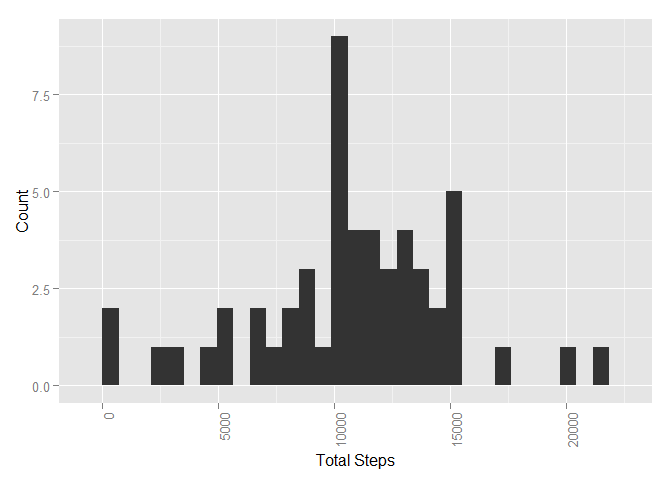
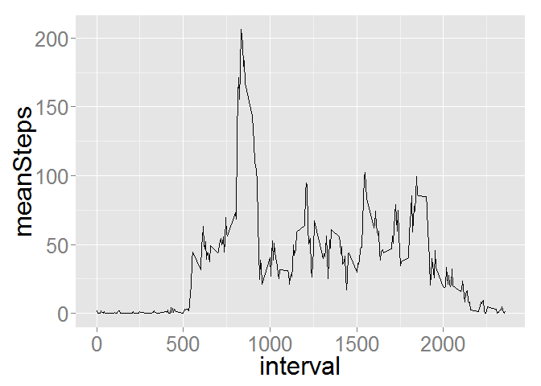
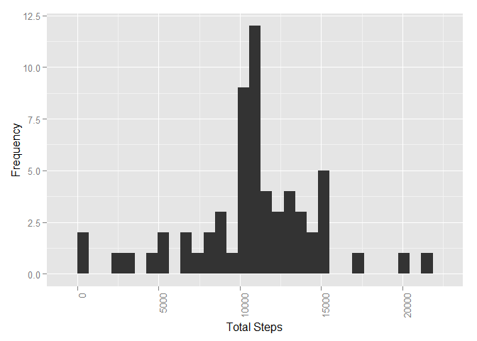
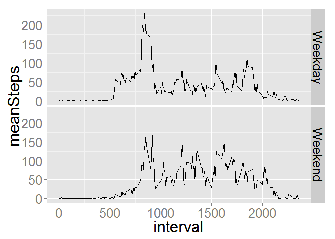

# Reproducible Research: Peer Assessment 1

This document will follow the steps needed to answer questions asked in Peer Review Project #1

**First load up the libraries needed**

```r
library(ggplot2)
library(dplyr)
```

```
## 
## Attaching package: 'dplyr'
## 
## The following objects are masked from 'package:stats':
## 
##     filter, lag
## 
## The following objects are masked from 'package:base':
## 
##     intersect, setdiff, setequal, union
```


##Loading and preprocessing the data
Show any code that is needed to  

1. Load the data (i.e. read.csv())
2. Process/transform the data (if necessary) into a format suitable for your analysis

    **A quick load of the csv file with read.csv**
    
    ```r
    activityTrackingData <- read.csv("activity.csv", header = TRUE, sep = ",")
    ```


##What is mean total number of steps taken per day?
For this part of the assignment, you can ignore the missing values in the dataset.  


1. Calculate the total number of steps taken per day

    **using dlpyr here to omit NA and summarize the total**
    
    ```r
    totalStepsPerDay <- activityTrackingData %>% na.omit() %>% group_by(date) %>% summarize(TotalSteps = sum(steps))
    ```


2. If you do not understand the difference between a histogram and a barplot, research the difference between them. Make a histogram of the total number of steps taken each day

    
    ```r
    totalStepHistorgram <- ggplot(data = totalStepsPerDay, aes(totalStepsPerDay$TotalSteps)) + geom_histogram() + theme(axis.text.x = element_text(angle = 90, hjust = 1)) + labs(x = "Total Steps", y = "Count")
    print(totalStepHistorgram)
    ```
    
    ```
    ## stat_bin: binwidth defaulted to range/30. Use 'binwidth = x' to adjust this.
    ```
    
     


3. Calculate and report the mean and median of the total number of steps taken per day

    **Mean and median reported below**
    
    ```r
    mean(totalStepsPerDay$TotalSteps)
    ```
    
    ```
    ## [1] 10766.19
    ```
    
    ```r
    median(totalStepsPerDay$TotalSteps)
    ```
    
    ```
    ## [1] 10765
    ```


##What is the average daily activity pattern?


1. Make a time series plot (i.e. type = "l") of the 5-minute interval (x-axis) and the average number of steps taken, averaged across all days (y-axis)

    
    ```r
    stepsPerTimeInterval <- activityTrackingData %>% na.omit() %>% group_by(interval) %>% summarize(meanSteps = mean(steps))
    
    ggplot(stepsPerTimeInterval, aes(x=interval, y = meanSteps)) + geom_line() + theme(text = element_text(size = 24))
    ```
    
     


2. Which 5-minute interval, on average across all the days in the dataset, contains the maximum number of steps?

    **The interval 835 (below) cooresponds to the maximum steps**
    
    ```r
    maxInterval <- which.max(stepsPerTimeInterval$meanSteps)
    stepsPerTimeInterval[maxInterval,1]
    ```
    
    ```
    ## Source: local data frame [1 x 1]
    ## 
    ##   interval
    ##      (int)
    ## 1      835
    ```


##Imputing missing values

Note that there are a number of days/intervals where there are missing values (coded as NA). The presence of missing days may introduce bias into some calculations or summaries of the data.

1. Calculate and report the total number of missing values in the dataset (i.e. the total number of rows with NAs)

    
    ```r
    sum(is.na(activityTrackingData$steps))
    ```
    
    ```
    ## [1] 2304
    ```


2. Devise a strategy for filling in all of the missing values in the dataset. The strategy does not need to be sophisticated. For example, you could use the mean/median for that day, or the mean for that 5-minute interval, etc.

    **All the NAs in the original data occur across entire days.  That is, a day is either completely there or completely NA.  So I will use the mean for that 5 minute interval across the entire dataset to fill in missing data for those days which are completely missing.  This keeps the mean of each interval (and subsequently the mean per day) the same across the entire data set.**


3. Create a new dataset that is equal to the original dataset but with the missing data filled in.

    **Loop through all lines in the data frame and replace the NA with the corresponding average from the previously calculated interval average.**
    
    
    ```r
    replacedNAactivityTrackingData <- activityTrackingData
    
    for (i in 1:nrow(replacedNAactivityTrackingData)){
            if (is.na(replacedNAactivityTrackingData[i,1])){
                    stepInterval <- replacedNAactivityTrackingData[i,3]
                    stepRefLine <- which(stepsPerTimeInterval[,1] == stepInterval)
                    StepIntervalAverage <- stepsPerTimeInterval[stepRefLine,2]
                    replacedNAactivityTrackingData[i,1] <- StepIntervalAverage
            }
    }
    ```


4. Make a histogram of the total number of steps taken each day and Calculate and report the mean and median total number of steps taken per day. Do these values differ from the estimates from the first part of the assignment? What is the impact of imputing missing data on the estimates of the total daily number of steps?

    **The 8 days which were complete NAs in the original data are now included in the histogram, all at the daily mean.**
    
    **The mean value is the same as the original data due to the way I generated data (using the previous means).  The median however has shifted slightly, and is now equivalent to the mean due to adding several new days which have that value.**
    
    **Adding estimates based on means of the previous data created a new spike at the mean, which makes the distirbutin look more centered.**
    
    
    
    ```r
    totalStepsPerDayNAreplaced <- replacedNAactivityTrackingData %>% group_by(date) %>% summarize(TotalSteps = sum(steps))
    
    totalStepHistorgramNAreplaced <- ggplot(data = totalStepsPerDayNAreplaced, aes(totalStepsPerDayNAreplaced$TotalSteps)) + geom_histogram() + theme(axis.text.x = element_text(angle = 90, hjust = 1)) + labs(x = "Total Steps", y = "Count")
    print(totalStepHistorgramNAreplaced)
    ```
    
    ```
    ## stat_bin: binwidth defaulted to range/30. Use 'binwidth = x' to adjust this.
    ```
    
     
    
    ```r
    mean(totalStepsPerDayNAreplaced$TotalSteps)
    ```
    
    ```
    ## [1] 10766.19
    ```
    
    ```r
    median(totalStepsPerDayNAreplaced$TotalSteps)
    ```
    
    ```
    ## [1] 10766.19
    ```


##Are there differences in activity patterns between weekdays and weekends?

For this part the weekdays() function may be of some help here. Use the dataset with the filled-in missing values for this part.

1. Create a new factor variable in the dataset with two levels - "weekday" and "weekend" indicating whether a given date is a weekday or weekend day.

    **mapply through the dataframe, determining if the day is a weekend or weekday, and bind the new values to a new column**
    
    
    ```r
    weekendRef <- c("Sunday","Saturday")
    
    activityTrackingDayType <- cbind(replacedNAactivityTrackingData, dayType = mapply(function(x) if (weekdays(x) %in% weekendRef){"Weekend"}else{"Weekday"}, as.Date(replacedNAactivityTrackingData$date)))
    ```


2. Make a panel plot containing a time series plot (i.e. type = "l") of the 5-minute interval (x-axis) and the average number of steps taken, averaged across all weekday days or weekend days (y-axis). See the README file in the GitHub repository to see an example of what this plot should look like using simulated data.

    
    ```r
    stepsPerTimeIntervalDaytype <- activityTrackingDayType %>% group_by(interval, dayType) %>% summarize(meanSteps = mean(steps))
    
    ggplot(stepsPerTimeIntervalDaytype, aes(x=interval, y = meanSteps)) + geom_line() + facet_grid(dayType ~ .) + theme(text = element_text(size = 24))
    ```
    
     


